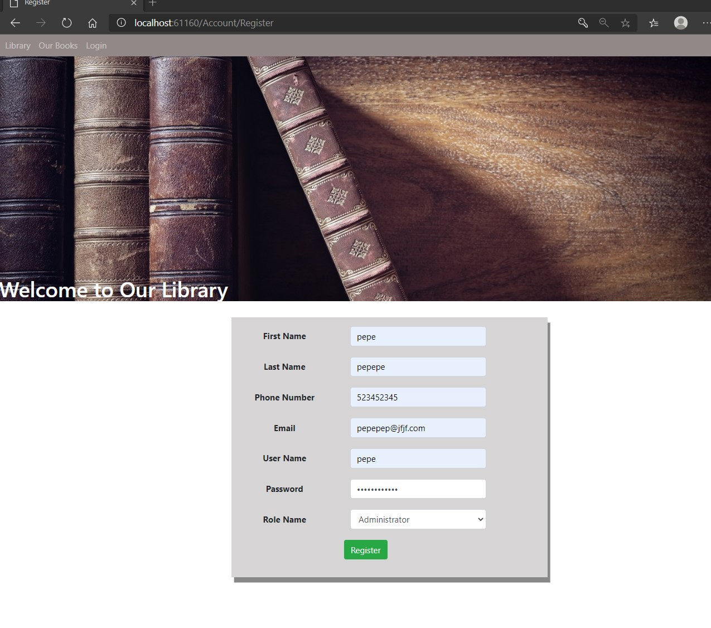
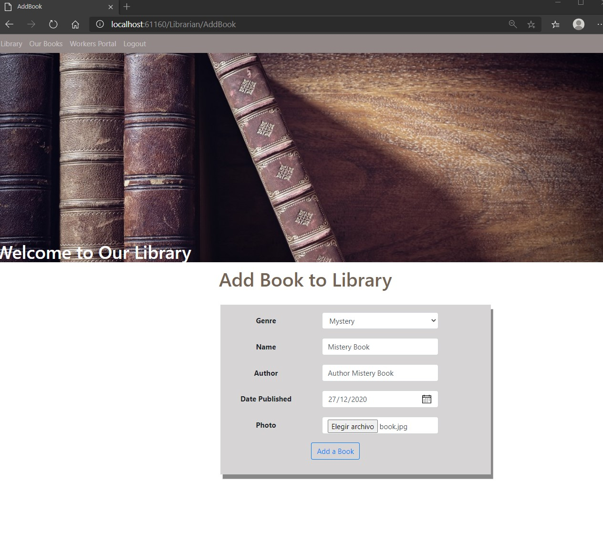
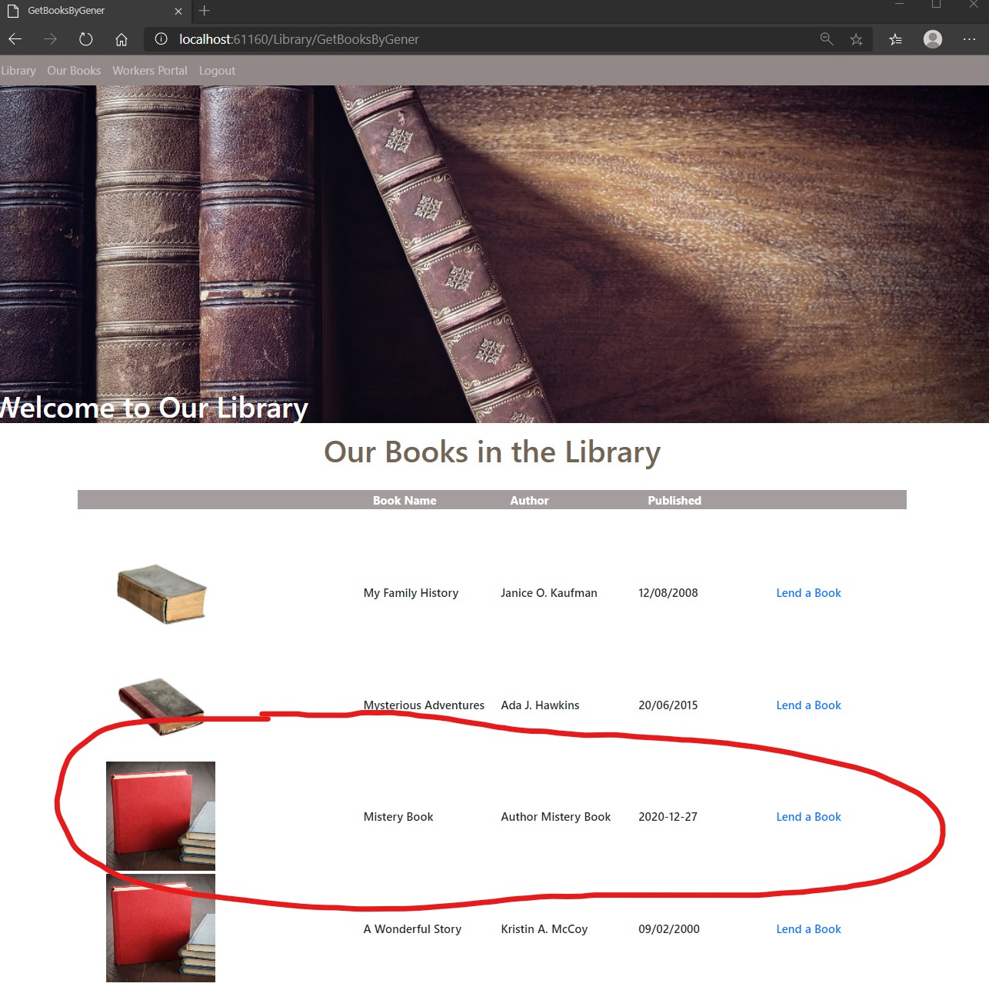

# Module 11: Managing Security

## Lab: Managing Security

1. **Nombres y apellidos:** Francisco Javier Moreno Quevedo
2. **Fecha:** 02/12/2020
3. **Resumen del Ejercicio:** implementarla seguridad en el proyecto 2/3
4. **Dificultad o problemas presentados y como se resolvieron:** Ninguna

Ejercicio 2: Add Authorization

- EN el LibraryController incluimos la etiqueta para que se pueda acceder de forma anonima al index y de forma autorizada al GetBooksByGener y al LendingBookPost

- En el  RegisterViewModel incluimos la etiqueta para quue el usuario seleccione el role

- En el  AccountController lo modificamos para que acepte roles y los reclamos

- La vista de Register.cshtml añadimos los roles

- En el middleware Incluimos los avisos por email

- Ejecutamos

  

